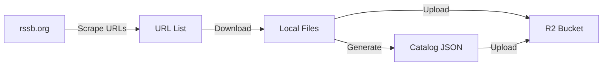

# Content Download & Catalog Guide

This guide explains how to download content from rssb.org and prepare it for your R2 bucket.

## Overview



---

## Content Sources

| Source | Type | Estimated Size | Download Method |
|--------|------|----------------|-----------------|
| [audiobooks.html](https://rssb.org/audiobooks.html) | Multi-chapter books | ~3-5 GB | Individual book pages |
| [QandA.html](https://rssb.org/QandA.html) | 82 MP3 files | 2.6 GB | Direct ZIP or individual |
| [shabads.html](https://rssb.org/shabads.html) | ~150 MP3 files | 600 MB | Direct ZIP available |
| [discourses_audios.html](https://rssb.org/discourses_audios.html) | Multi-language | ~1 GB | Per-language sections |
| [discourses.html](https://rssb.org/discourses.html) | 6 languages | ~500 MB | Per-language pages |

---

## Method 1: Manual Download (Recommended for Subset)

### Q&A Sessions (Easiest)
The Q&A page offers a complete ZIP download:
```
https://rssb.org/audio/QandA/Questions-Answers-of-Hazur-Maharaj-Charan-Singh.zip
```
Size: 2.6 GB

### Shabads
Two ZIP options available:
- By Title: `https://rssb.org/audio/Shabads-by-Title.zip` (600 MB)
- By Mystic: `https://rssb.org/audio/Shabads-by-Mystic.zip` (600 MB)

### Audiobooks
Each audiobook has its own page with chapter MP3s. Example:
- Page: `https://rssb.org/audio-awareness-of-the-divine.html`
- Files: Individual chapter MP3s linked on the page

---

## Method 2: Python Scraper Script

Create `tools/scraper.py`:

```python
#!/usr/bin/env python3
"""
RSSB Content Scraper
Downloads audio content and generates catalog JSON files.
"""

import os
import json
import requests
from bs4 import BeautifulSoup
from urllib.parse import urljoin
import time

BASE_URL = "https://rssb.org"
OUTPUT_DIR = "./downloads"

def scrape_audiobooks():
    """Scrape audiobook listing and download chapters."""
    url = f"{BASE_URL}/audiobooks.html"
    resp = requests.get(url)
    soup = BeautifulSoup(resp.text, 'html.parser')
    
    audiobooks = []
    
    # Find all audiobook links
    for link in soup.select('a[href*="audio-"]'):
        book_url = urljoin(BASE_URL, link['href'])
        title = link.text.strip()
        
        if not title or 'audio-' not in book_url:
            continue
            
        print(f"Found: {title}")
        
        # Get book page for chapters
        book_resp = requests.get(book_url)
        book_soup = BeautifulSoup(book_resp.text, 'html.parser')
        
        chapters = []
        for mp3_link in book_soup.select('a[href$=".mp3"]'):
            mp3_url = urljoin(BASE_URL, mp3_link['href'])
            chapter_title = mp3_link.text.strip() or f"Chapter {len(chapters)+1}"
            
            chapters.append({
                "title": chapter_title,
                "url": mp3_url
            })
        
        book_id = book_url.split('/')[-1].replace('.html', '').replace('audio-', '')
        
        audiobooks.append({
            "id": book_id,
            "title": title,
            "type": "AUDIOBOOK",
            "sourceUrl": book_url,
            "chapters": chapters
        })
        
        time.sleep(0.5)  # Be respectful
    
    return audiobooks

def scrape_qna():
    """Get Q&A session list."""
    # Q&A has numbered sessions 1-82
    sessions = []
    for i in range(1, 83):
        sessions.append({
            "id": f"qna-{i:03d}",
            "title": f"Q&A Session {i}",
            "type": "QNA",
            "trackNumber": i,
            # Actual URLs may vary - check page source
            "streamUrl": f"qna/{i:03d}.mp3"
        })
    return sessions

def scrape_shabads():
    """Scrape shabad listing."""
    url = f"{BASE_URL}/shabads.html"
    resp = requests.get(url)
    soup = BeautifulSoup(resp.text, 'html.parser')
    
    shabads = []
    # Parse the shabad table/list
    # Structure varies - inspect page HTML
    
    return shabads

def download_file(url, output_path):
    """Download a file with progress."""
    os.makedirs(os.path.dirname(output_path), exist_ok=True)
    
    if os.path.exists(output_path):
        print(f"  Skipping (exists): {output_path}")
        return
    
    print(f"  Downloading: {url}")
    resp = requests.get(url, stream=True)
    
    with open(output_path, 'wb') as f:
        for chunk in resp.iter_content(chunk_size=8192):
            f.write(chunk)

def generate_catalog(content, output_file):
    """Generate catalog JSON file."""
    os.makedirs(os.path.dirname(output_file), exist_ok=True)
    
    with open(output_file, 'w', encoding='utf-8') as f:
        json.dump(content, f, indent=2, ensure_ascii=False)
    
    print(f"Generated: {output_file}")

def main():
    os.makedirs(OUTPUT_DIR, exist_ok=True)
    
    # Scrape audiobooks
    print("\n=== Scraping Audiobooks ===")
    audiobooks = scrape_audiobooks()
    generate_catalog(audiobooks, f"{OUTPUT_DIR}/catalog/audiobooks.json")
    
    # Scrape Q&A
    print("\n=== Generating Q&A Catalog ===")
    qna = scrape_qna()
    generate_catalog(qna, f"{OUTPUT_DIR}/catalog/qna.json")
    
    print("\n=== Done! ===")
    print(f"Catalogs saved to {OUTPUT_DIR}/catalog/")
    print("Next: Download audio files and upload to R2")

if __name__ == "__main__":
    main()
```

### Install dependencies:
```bash
pip install requests beautifulsoup4
```

### Run:
```bash
python tools/scraper.py
```

---

## Method 3: Browser Developer Tools

For pages with complex JavaScript:

1. Open the page in Chrome
2. Open DevTools (F12) → Network tab
3. Filter by "media" or ".mp3"
4. Play each track briefly to capture URLs
5. Right-click → Copy → Copy all URLs

---

## Catalog JSON Format

After downloading, create catalog files for the app:

### `catalog/audiobooks.json`
```json
[
  {
    "id": "awareness-of-the-divine",
    "title": "Awareness of the Divine",
    "type": "AUDIOBOOK",
    "language": "en",
    "description": "Narrated RSSB publication",
    "thumbnailUrl": "thumbnails/audiobooks/awareness-of-the-divine.jpg",
    "chapters": [
      {
        "id": "awareness-of-the-divine-01",
        "title": "Introduction",
        "trackNumber": 1,
        "duration": 1800,
        "streamUrl": "audio/audiobooks/awareness-of-the-divine/01.mp3"
      }
    ]
  }
]
```

### `catalog/qna.json`
```json
[
  {
    "id": "qna-001",
    "title": "Q&A Session 1",
    "type": "QNA",
    "speaker": "Maharaj Charan Singh",
    "duration": 3600,
    "streamUrl": "audio/qna/001.mp3",
    "dateAdded": 1702300800
  }
]
```

### `catalog/shabads.json`
```json
[
  {
    "id": "aaj-divas-leoon-balihaara",
    "title": "Aaj Divas Leoon Balihaara",
    "type": "SHABAD",
    "mystic": "Guru Arjan Dev",
    "duration": 420,
    "streamUrl": "audio/shabads/aaj-divas-leoon-balihaara.mp3",
    "hasTranscript": true
  }
]
```

### `catalog/discourses.json`
```json
[
  {
    "id": "discourse-en-001",
    "title": "Among Your Companions, None Is Your Friend",
    "type": "DISCOURSE_MASTER",
    "language": "en",
    "speaker": "Maharaj Charan Singh (Translation)",
    "duration": 3600,
    "streamUrl": "audio/discourses/en/among-your-companions.mp3"
  }
]
```

---

## Upload to R2

### Using Wrangler CLI:
```bash
# Upload catalog files
wrangler r2 object put rssb-stream/catalog/audiobooks.json --file ./downloads/catalog/audiobooks.json
wrangler r2 object put rssb-stream/catalog/qna.json --file ./downloads/catalog/qna.json

# Upload audio files
wrangler r2 object put rssb-stream/audio/qna/001.mp3 --file ./downloads/audio/qna/001.mp3
```

### Using rclone (faster for bulk):
```bash
# Configure rclone for R2 first
# See: https://developers.cloudflare.com/r2/examples/rclone/

rclone sync ./downloads r2:rssb-stream --progress
```

---

## Recommended Starting Subset

For v1, start with:
1. **5-10 Q&A Sessions** (easy to test streaming)
2. **1 Audiobook** (test chapter navigation)
3. **10 Shabads** (test search/filtering)
4. **2-3 Discourses** (one per language)

This gives ~500MB to upload and test the full app flow.

---

## Directory Structure After Download

```
downloads/
├── catalog/
│   ├── audiobooks.json
│   ├── qna.json
│   ├── shabads.json
│   └── discourses.json
├── audio/
│   ├── audiobooks/
│   │   └── awareness-of-the-divine/
│   │       ├── 01.mp3
│   │       └── ...
│   ├── qna/
│   │   ├── 001.mp3
│   │   └── ...
│   ├── shabads/
│   │   └── ...
│   └── discourses/
│       ├── en/
│       ├── hi/
│       └── ...
└── thumbnails/
    └── ...
```
